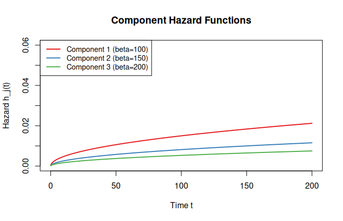
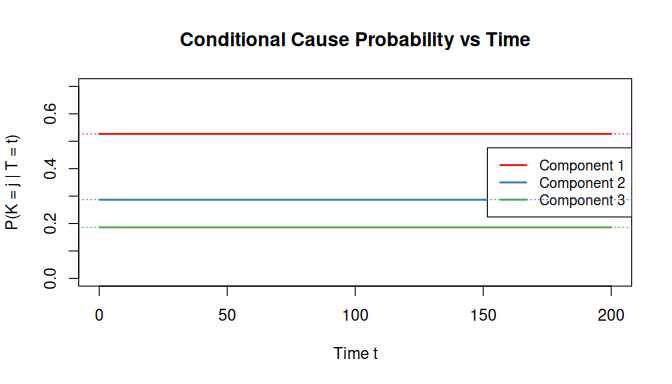
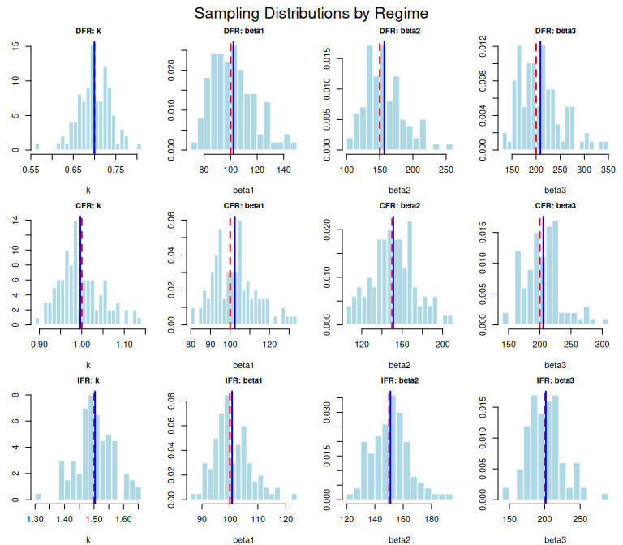

# Homogeneous Weibull Series Systems: Shared Shape Parameter

## Theory

### Component lifetime model

Consider a series system with $m$ components where each component
lifetime follows a Weibull distribution with a **common shape
parameter** $k$ but individual scale parameters
$\beta_{1},\ldots,\beta_{m}$. The parameter vector is
$$\theta = \left( k,\beta_{1},\ldots,\beta_{m} \right) \in {\mathbb{R}}_{> 0}^{m + 1}.$$

The $j$-th component has hazard function
$$h_{j}\left( t \mid k,\beta_{j} \right) = \frac{k}{\beta_{j}}\left( \frac{t}{\beta_{j}} \right)^{k - 1},\quad t > 0,$$
survival function
$$R_{j}\left( t \mid k,\beta_{j} \right) = \exp\!\left( - \left( \frac{t}{\beta_{j}} \right)^{k} \right),$$
and pdf
$$f_{j}\left( t \mid k,\beta_{j} \right) = h_{j}(t)\, R_{j}(t) = \frac{k}{\beta_{j}}\left( \frac{t}{\beta_{j}} \right)^{k - 1}\exp\!\left( - \left( \frac{t}{\beta_{j}} \right)^{k} \right).$$

The shape parameter $k$ controls the failure rate behaviour:

- $k < 1$: decreasing failure rate (DFR) – infant mortality, burn-in
- $k = 1$: constant failure rate (CFR) – exponential distribution
- $k > 1$: increasing failure rate (IFR) – wear-out, aging

### System lifetime

The system lifetime $T = \min\left( T_{1},\ldots,T_{m} \right)$ has
reliability
$$R_{\text{sys}}(t \mid \theta) = \prod\limits_{j = 1}^{m}R_{j}(t) = \exp\!\left( - \sum\limits_{j = 1}^{m}\left( \frac{t}{\beta_{j}} \right)^{k} \right).$$

Because all components share the same shape $k$, the exponent
simplifies:
$$\sum\limits_{j = 1}^{m}\left( \frac{t}{\beta_{j}} \right)^{k} = t^{k}\sum\limits_{j = 1}^{m}\beta_{j}^{- k} = \left( \frac{t}{\beta_{\text{sys}}} \right)^{k},$$
where
$$\beta_{\text{sys}} = \left( \sum\limits_{j = 1}^{m}\beta_{j}^{- k} \right)^{- 1/k}.$$
Thus, the system lifetime is itself Weibull with shape $k$ and scale
$\beta_{\text{sys}}$:
$$T \sim \operatorname{Weibull}\left( k,\beta_{\text{sys}} \right).$$
This closure under the minimum operation is the defining structural
advantage of the homogeneous model and is computed by
`wei_series_system_scale(k, scales)`.

### Conditional cause probability

The conditional probability that component $j$ caused the system failure
at time $t$ is
$$P(K = j \mid T = t,\theta) = \frac{h_{j}(t)}{h_{\text{sys}}(t)} = \frac{\beta_{j}^{- k} \cdot \left( k/\beta_{j} \right)\left( t/\beta_{j} \right)^{k - 1}}{\sum\limits_{l}\beta_{l}^{- k} \cdot \left( k/\beta_{l} \right)\left( t/\beta_{l} \right)^{k - 1}}.$$
The $t^{k - 1}$ and $k$ factors cancel, yielding
$$P(K = j \mid T = t,\theta) = \frac{\beta_{j}^{- k}}{\sum\limits_{l = 1}^{m}\beta_{l}^{- k}} ≕ w_{j}.$$
Remarkably, this does **not** depend on the failure time $t$ – the
conditional cause probability is constant, just as in the exponential
case. This occurs because every component hazard shares the same
power-law time dependence $t^{k - 1}$, which cancels in the ratio. We
define the **cause weights**
$$w_{j} = \frac{\beta_{j}^{- k}}{\sum\limits_{l = 1}^{m}\beta_{l}^{- k}}.$$

### Marginal cause probability

Since $P(K = j \mid T = t,\theta)$ is independent of $t$, the marginal
probability integrates trivially:
$$P(K = j \mid \theta) = {\mathbb{E}}_{T}\left\lbrack P(K = j \mid T,\theta) \right\rbrack = w_{j} = \frac{\beta_{j}^{- k}}{\sum\limits_{l = 1}^{m}\beta_{l}^{- k}}.$$
Components with smaller scale parameters (shorter expected lifetimes)
are more likely to be the cause of system failure.

### Connection to the exponential model

When $k = 1$, the Weibull distribution reduces to the exponential with
rate $\lambda_{j} = 1/\beta_{j}$. In this case:

- The system scale becomes
  $\beta_{\text{sys}} = \left( 1/\sum_{j}\beta_{j}^{- 1} \right)$ and
  the system rate is $\lambda_{\text{sys}} = \sum_{j}\lambda_{j}$.
- The cause weights become $w_{j} = \lambda_{j}/\lambda_{\text{sys}}$.
- All likelihood contributions reduce to the `exp_series_md_c1_c2_c3`
  forms.

We verify this identity numerically in the [Weibull(k=1) = Exponential
Identity](#exponential-identity) section below.

## Worked Example

We construct a 3-component homogeneous Weibull series system with
increasing failure rate ($k = 1.5$):

``` r
theta <- c(k = 1.5, beta1 = 100, beta2 = 150, beta3 = 200)
k <- theta[1]
scales <- theta[-1]
m <- length(scales)

beta_sys <- wei_series_system_scale(k, scales)
cat("System scale (beta_sys):", round(beta_sys, 2), "\n")
#> System scale (beta_sys): 65.24
cat("System mean lifetime:", round(beta_sys * gamma(1 + 1/k), 2), "\n")
#> System mean lifetime: 58.89
```

### Component hazards

The
[`component_hazard()`](https://queelius.github.io/likelihood.model.series.md/reference/component_hazard.md)
generic returns a closure for the $j$-th component hazard. We overlay
all three to visualize how failure intensity changes over time:

``` r
model <- wei_series_homogeneous_md_c1_c2_c3()
t_grid <- seq(0.1, 200, length.out = 300)

cols <- c("#E41A1C", "#377EB8", "#4DAF4A")
plot(NULL, xlim = c(0, 200), ylim = c(0, 0.06),
     xlab = "Time t", ylab = "Hazard h_j(t)",
     main = "Component Hazard Functions")
for (j in seq_len(m)) {
  h_j <- component_hazard(model, j)
  lines(t_grid, h_j(t_grid, theta), col = cols[j], lwd = 2)
}
legend("topleft", paste0("Component ", 1:m, " (beta=", scales, ")"),
       col = cols, lwd = 2, cex = 0.9)
```



All three hazard curves are increasing ($k > 1$), but component 1
(smallest scale) has the steepest rate of increase and dominates at all
times.

### Cause probabilities

``` r
# Analytical cause weights: w_j = beta_j^{-k} / sum(beta_l^{-k})
w <- scales^(-k) / sum(scales^(-k))
names(w) <- paste0("Component ", 1:m)
cat("Cause weights (w_j):\n")
#> Cause weights (w_j):
print(round(w, 4))
#> Component 1 Component 2 Component 3 
#>      0.5269      0.2868      0.1863
```

The
[`conditional_cause_probability()`](https://queelius.github.io/likelihood.model.series.md/reference/conditional_cause_probability.md)
generic confirms these are time-invariant:

``` r
ccp_fn <- conditional_cause_probability(
  wei_series_homogeneous_md_c1_c2_c3(scales = scales)
)
probs <- ccp_fn(t_grid, theta)

plot(NULL, xlim = c(0, 200), ylim = c(0, 0.7),
     xlab = "Time t", ylab = "P(K = j | T = t)",
     main = "Conditional Cause Probability vs Time")
for (j in seq_len(m)) {
  lines(t_grid, probs[, j], col = cols[j], lwd = 2)
}
legend("right", paste0("Component ", 1:m),
       col = cols, lwd = 2, cex = 0.9)
abline(h = w, col = cols, lty = 3)
```



The conditional cause probabilities are flat lines, confirming that the
homogeneous shape creates time-invariant cause attributions – a key
structural simplification shared with the exponential model.

### Data generation with periodic inspection

``` r
gen <- rdata(model)

set.seed(2024)
df <- gen(theta, n = 500, p = 0.3,
          observe = observe_periodic(delta = 20, tau = 250))

cat("Observation types:\n")
#> Observation types:
print(table(df$omega))
#> 
#> interval 
#>      500
cat("\nFirst 6 rows:\n")
#> 
#> First 6 rows:
print(head(df), row.names = FALSE)
#>    t    omega t_upper    x1    x2    x3
#>    0 interval      20 FALSE  TRUE  TRUE
#>  100 interval     120  TRUE FALSE FALSE
#>   40 interval      60  TRUE FALSE FALSE
#>   40 interval      60  TRUE FALSE  TRUE
#>   40 interval      60 FALSE  TRUE FALSE
#>   40 interval      60  TRUE FALSE  TRUE
```

## Likelihood Contributions

The log-likelihood under conditions C1, C2, C3 decomposes into
individual observation contributions. The homogeneous shape is critical:
because the system lifetime is Weibull($k$, $\beta_{\text{sys}}$), left-
and interval-censored terms have **closed-form** expressions involving
only the system Weibull CDF and cause weights $w_{c}$.

Let $c_{i}$ denote the candidate set for observation $i$ and define
$w_{c_{i}} = \sum_{j \in c_{i}}\beta_{j}^{- k}/\sum_{l}\beta_{l}^{- k}$.

### Exact observation ($\omega_{i} = \text{exact}$)

The system failed at observed time $t_{i}$:
$$\ell_{i} = \log\!\left( \sum\limits_{j \in c_{i}}h_{j}\left( t_{i} \right) \right) - \sum\limits_{j = 1}^{m}\left( \frac{t_{i}}{\beta_{j}} \right)^{k}.$$

### Right-censored ($\omega_{i} = \text{right}$)

The system survived past $t_{i}$ (no candidate set information):
$$\ell_{i} = - \sum\limits_{j = 1}^{m}\left( \frac{t_{i}}{\beta_{j}} \right)^{k} = - \left( \frac{t_{i}}{\beta_{\text{sys}}} \right)^{k}.$$

### Left-censored ($\omega_{i} = \text{left}$)

The system failed before inspection time $\tau_{i}$:
$$\ell_{i} = \log w_{c_{i}} + \log\!\left( 1 - \exp\!\left( - \left( \frac{\tau_{i}}{\beta_{\text{sys}}} \right)^{k} \right) \right).$$
This is $\log w_{c_{i}} + \log F_{\text{sys}}\left( \tau_{i} \right)$,
where $F_{\text{sys}}$ is the system Weibull CDF – a closed form that
does **not** require numerical integration. The $w_{c_{i}}$ term arises
because, under homogeneous shapes, the cause attribution and system
lifetime factor cleanly.

### Interval-censored ($\omega_{i} = \text{interval}$)

The system failed in $\left( a_{i},b_{i} \right)$:
$$\ell_{i} = \log w_{c_{i}} - \left( \frac{a_{i}}{\beta_{\text{sys}}} \right)^{k} + \log\!\left( 1 - \exp\!\left( - \left( \left( \frac{b_{i}}{\beta_{\text{sys}}} \right)^{k} - \left( \frac{a_{i}}{\beta_{\text{sys}}} \right)^{k} \right) \right) \right).$$
This is
$\log w_{c_{i}} + \log\left( R_{\text{sys}}\left( a_{i} \right) - R_{\text{sys}}\left( b_{i} \right) \right)$,
again in closed form.

### Why homogeneous shapes enable closed forms

In the heterogeneous Weibull model (`wei_series_md_c1_c2_c3`), the
system survival function
$R_{\text{sys}}(t) = \prod_{j}\exp\left( - \left( t/\beta_{j} \right)^{k_{j}} \right)$
does not reduce to a single Weibull, so the left- and interval-censored
contributions require numerical integration via `cubature`. The
homogeneous constraint $k_{j} = k$ for all $j$ collapses the product
into a single Weibull CDF evaluation, and the cause weights $w_{c_{i}}$
separate from the time dependence. This makes the homogeneous model
substantially faster and more numerically stable for censored data.

## MLE Fitting

We fit the model to the periodically inspected data generated above
using the [`fit()`](https://generics.r-lib.org/reference/fit.html)
generic, which returns a solver based on `optim`:

``` r
solver <- fit(model)
theta0 <- c(1.2, 110, 140, 180)  # Initial guess near true values

estimate <- solver(df, par = theta0, method = "Nelder-Mead")
print(estimate)
#> Maximum Likelihood Estimate (Fisherian)
#> ----------------------------------------
#> Coefficients:
#> [1]   1.48 100.94 149.80 247.39
#> 
#> Log-likelihood: -1326 
#> Observations: 500
```

``` r
cat("True parameters: ", round(theta, 2), "\n")
#> True parameters:  1.5 100 150 200
cat("MLE estimates:   ", round(estimate$par, 2), "\n")
#> MLE estimates:    1.48 100.9 149.8 247.4
cat("Std errors:      ", round(sqrt(diag(estimate$vcov)), 2), "\n")
#> Std errors:       0.05 4.63 10.16 27.54
cat("Relative error:  ",
    round(100 * abs(estimate$par - theta) / theta, 1), "%\n")
#> Relative error:   1.4 0.9 0.1 23.7 %
```

### Score and Hessian computation

The score function uses a **hybrid approach**: analytical gradients for
exact and right-censored observations, and
[`numDeriv::grad`](https://rdrr.io/pkg/numDeriv/man/grad.html) for left-
and interval-censored observations. The Hessian is fully numerical,
computed as the Jacobian of the score via
[`numDeriv::jacobian`](https://rdrr.io/pkg/numDeriv/man/jacobian.html).

``` r
ll_fn <- loglik(model)
scr_fn <- score(model)
hess_fn <- hess_loglik(model)

# Score at MLE should be near zero
scr_mle <- scr_fn(df, estimate$par)
cat("Score at MLE:", round(scr_mle, 4), "\n")
#> Score at MLE: -0.141 -0.0018 -1e-04 -2e-04

# Verify score against numerical gradient
scr_num <- numDeriv::grad(function(th) ll_fn(df, th), estimate$par)
cat("Max |analytical - numerical| score:",
    formatC(max(abs(scr_mle - scr_num)), format = "e", digits = 2), "\n")
#> Max |analytical - numerical| score: 0.00e+00

# Hessian eigenvalues (should be negative for concavity)
H <- hess_fn(df, estimate$par)
cat("Hessian eigenvalues:", round(eigen(H)$values, 2), "\n")
#> Hessian eigenvalues: -431 -0.05 -0.01 0
```

## Monte Carlo Simulation Study

We compare estimation performance across three shape regimes: decreasing
failure rate ($k = 0.7$), constant ($k = 1.0$), and increasing
($k = 1.5$). Each scenario uses $m = 3$ components, $n = 500$
observations, Bernoulli masking with $p = 0.3$, and periodic inspection
with approximately 25% right-censoring.

``` r
set.seed(2024)

B <- 100          # Monte Carlo replications
n_mc <- 500       # Sample size per replication
p_mc <- 0.3       # Masking probability
alpha <- 0.05     # CI level

# Three shape regimes
scenarios <- list(
  DFR = c(k = 0.7, beta1 = 100, beta2 = 150, beta3 = 200),
  CFR = c(k = 1.0, beta1 = 100, beta2 = 150, beta3 = 200),
  IFR = c(k = 1.5, beta1 = 100, beta2 = 150, beta3 = 200)
)

results <- list()
```

``` r
model_mc <- wei_series_homogeneous_md_c1_c2_c3()
gen_mc <- rdata(model_mc)
solver_mc <- fit(model_mc)

for (sc_name in names(scenarios)) {
  th <- scenarios[[sc_name]]
  k_sc <- th[1]
  scales_sc <- th[-1]
  m_sc <- length(scales_sc)
  npars <- m_sc + 1

  # Choose tau to give ~25% right-censoring
  beta_sys_sc <- wei_series_system_scale(k_sc, scales_sc)
  tau_sc <- qweibull(0.75, shape = k_sc, scale = beta_sys_sc)
  delta_sc <- tau_sc / 10  # ~10 inspection intervals

  estimates <- matrix(NA, nrow = B, ncol = npars)
  se_est <- matrix(NA, nrow = B, ncol = npars)
  ci_lower <- matrix(NA, nrow = B, ncol = npars)
  ci_upper <- matrix(NA, nrow = B, ncol = npars)
  converged <- logical(B)
  cens_fracs <- numeric(B)

  for (b in seq_len(B)) {
    df_b <- gen_mc(th, n = n_mc, p = p_mc,
                   observe = observe_periodic(delta = delta_sc, tau = tau_sc))
    cens_fracs[b] <- mean(df_b$omega == "right")

    tryCatch({
      est_b <- solver_mc(df_b, par = c(1, rep(120, m_sc)),
                         method = "L-BFGS-B",
                         lower = rep(1e-6, npars))
      estimates[b, ] <- est_b$par
      se_est[b, ] <- sqrt(diag(est_b$vcov))
      z <- qnorm(1 - alpha / 2)
      ci_lower[b, ] <- est_b$par - z * se_est[b, ]
      ci_upper[b, ] <- est_b$par + z * se_est[b, ]
      converged[b] <- est_b$converged
    }, error = function(e) {
      converged[b] <<- FALSE
    })
  }

  results[[sc_name]] <- list(
    theta = th, estimates = estimates, se_est = se_est,
    ci_lower = ci_lower, ci_upper = ci_upper,
    converged = converged, cens_fracs = cens_fracs,
    tau = tau_sc, delta = delta_sc
  )
}
```

#### Bias and MSE by shape regime

``` r
summary_rows <- list()

for (sc_name in names(results)) {
  res <- results[[sc_name]]
  th <- res$theta
  valid <- res$converged & !is.na(res$estimates[, 1])
  est_v <- res$estimates[valid, , drop = FALSE]

  bias <- colMeans(est_v) - th
  variance <- apply(est_v, 2, var)
  mse <- bias^2 + variance
  pnames <- c("k", paste0("beta", seq_along(th[-1])))

  for (j in seq_along(th)) {
    summary_rows[[length(summary_rows) + 1]] <- data.frame(
      Regime = sc_name,
      Parameter = pnames[j],
      True = th[j],
      Mean_Est = mean(est_v[, j]),
      Bias = bias[j],
      RMSE = sqrt(mse[j]),
      Rel_Bias_Pct = 100 * bias[j] / th[j],
      stringsAsFactors = FALSE
    )
  }
}

mc_table <- do.call(rbind, summary_rows)

knitr::kable(mc_table, digits = 3, row.names = FALSE,
             caption = "Monte Carlo Results by Shape Regime (B=100, n=500)",
             col.names = c("Regime", "Parameter", "True", "Mean Est.",
                          "Bias", "RMSE", "Rel. Bias %"))
```

| Regime | Parameter |  True | Mean Est. |   Bias |   RMSE | Rel. Bias % |
|:-------|:----------|------:|----------:|-------:|-------:|------------:|
| DFR    | k         |   0.7 |     0.700 |  0.000 |  0.039 |      -0.046 |
| DFR    | beta1     | 100.0 |   102.108 |  2.108 | 16.190 |       2.108 |
| DFR    | beta2     | 150.0 |   156.849 |  6.849 | 29.900 |       4.566 |
| DFR    | beta3     | 200.0 |   208.930 |  8.930 | 46.026 |       4.465 |
| CFR    | k         |   1.0 |     0.997 | -0.003 |  0.052 |      -0.329 |
| CFR    | beta1     | 100.0 |   102.388 |  2.388 | 11.367 |       2.388 |
| CFR    | beta2     | 150.0 |   151.217 |  1.217 | 21.640 |       0.811 |
| CFR    | beta3     | 200.0 |   205.608 |  5.608 | 30.815 |       2.804 |
| IFR    | k         |   1.5 |     1.503 |  0.003 |  0.064 |       0.231 |
| IFR    | beta1     | 100.0 |   100.785 |  0.785 |  6.674 |       0.785 |
| IFR    | beta2     | 150.0 |   150.996 |  0.996 | 13.150 |       0.664 |
| IFR    | beta3     | 200.0 |   201.455 |  1.455 | 24.228 |       0.728 |

Monte Carlo Results by Shape Regime (B=100, n=500)

#### Confidence interval coverage

``` r
coverage_rows <- list()

for (sc_name in names(results)) {
  res <- results[[sc_name]]
  th <- res$theta
  valid <- res$converged & !is.na(res$ci_lower[, 1])
  pnames <- c("k", paste0("beta", seq_along(th[-1])))

  for (j in seq_along(th)) {
    valid_j <- valid & !is.na(res$ci_lower[, j]) & !is.na(res$ci_upper[, j])
    covered <- (res$ci_lower[valid_j, j] <= th[j]) &
               (th[j] <= res$ci_upper[valid_j, j])
    width <- mean(res$ci_upper[valid_j, j] - res$ci_lower[valid_j, j])

    coverage_rows[[length(coverage_rows) + 1]] <- data.frame(
      Regime = sc_name,
      Parameter = pnames[j],
      Coverage = mean(covered),
      Mean_Width = width,
      stringsAsFactors = FALSE
    )
  }
}

cov_table <- do.call(rbind, coverage_rows)

knitr::kable(cov_table, digits = 3, row.names = FALSE,
             caption = "95% Wald CI Coverage by Shape Regime",
             col.names = c("Regime", "Parameter", "Coverage", "Mean Width"))
```

| Regime | Parameter | Coverage | Mean Width |
|:-------|:----------|---------:|-----------:|
| DFR    | k         |    0.949 |      0.150 |
| DFR    | beta1     |    0.949 |     60.773 |
| DFR    | beta2     |    0.960 |    115.664 |
| DFR    | beta3     |    0.970 |    176.434 |
| CFR    | k         |    0.950 |      0.193 |
| CFR    | beta1     |    0.940 |     39.604 |
| CFR    | beta2     |    0.900 |     76.988 |
| CFR    | beta3     |    0.980 |    127.453 |
| IFR    | k         |    0.980 |      0.275 |
| IFR    | beta1     |    0.950 |     22.968 |
| IFR    | beta2     |    0.950 |     52.617 |
| IFR    | beta3     |    0.950 |     92.139 |

95% Wald CI Coverage by Shape Regime

#### Censoring rates

``` r
for (sc_name in names(results)) {
  res <- results[[sc_name]]
  conv_rate <- mean(res$converged)
  cens_rate <- mean(res$cens_fracs[res$converged])
  cat(sprintf("%s (k=%.1f): convergence=%.1f%%, mean censoring=%.1f%%\n",
              sc_name, res$theta[1], 100 * conv_rate, 100 * cens_rate))
}
#> DFR (k=0.7): convergence=99.0%, mean censoring=25.2%
#> CFR (k=1.0): convergence=100.0%, mean censoring=25.0%
#> IFR (k=1.5): convergence=100.0%, mean censoring=25.0%
```

#### Sampling distribution visualization

``` r
par(mfrow = c(3, 4), mar = c(4, 3, 2, 1), oma = c(0, 0, 2, 0))
pnames <- c("k", "beta1", "beta2", "beta3")

for (sc_name in names(results)) {
  res <- results[[sc_name]]
  th <- res$theta
  valid <- res$converged & !is.na(res$estimates[, 1])
  est_v <- res$estimates[valid, , drop = FALSE]

  for (j in seq_along(th)) {
    hist(est_v[, j], breaks = 20, probability = TRUE,
         main = paste0(sc_name, ": ", pnames[j]),
         xlab = pnames[j],
         col = "lightblue", border = "white", cex.main = 0.9)
    abline(v = th[j], col = "red", lwd = 2, lty = 2)
    abline(v = mean(est_v[, j]), col = "blue", lwd = 2)
  }
}

mtext("Sampling Distributions by Regime", outer = TRUE, cex = 1.2)
```



#### Interpretation

The Monte Carlo study reveals several patterns:

- **Shape estimation accuracy varies by regime.** In absolute terms, the
  DFR regime ($k = 0.7$) has the smallest shape RMSE, while IFR
  ($k = 1.5$) has the best *relative* precision (RMSE/$k$). IFR has the
  widest absolute confidence intervals simply because the parameter
  value is largest; the relative CI width (width/$k$) is actually
  smallest for IFR. The steeper curvature of the IFR hazard function
  provides stronger signal about the shape parameter relative to its
  magnitude.

- **Scale estimation is robust across regimes.** Relative bias in the
  scale parameters is below 5% in all three regimes. Coverage is near
  the nominal 95% for most parameters, though a few (e.g., CFR
  $\beta_{2}$) show undercoverage around 90%, which is borderline
  significant at $B = 100$ replications. In the DFR regime, scale
  parameters exhibit positive bias that increases with the true scale
  value.

- **Periodic inspection adds interval-censoring.** Unlike the
  exponential vignette which used only exact + right observations, this
  study uses periodic inspection. The closed-form interval-censored
  contributions (unique to the homogeneous model) keep computation fast
  despite the additional complexity.

## Weibull($k = 1$) = Exponential Identity

When $k = 1$, the homogeneous Weibull model reduces to the exponential
model. We verify this numerically by comparing log-likelihoods on the
same data.

``` r
# Parameters: k=1 with scales equivalent to rates (1/beta_j)
exp_rates <- c(0.01, 0.008, 0.005)
wei_scales <- 1 / exp_rates  # beta = 1/lambda
wei_theta <- c(1, wei_scales)

# Generate data under exponential model
exp_model <- exp_series_md_c1_c2_c3()
exp_gen <- rdata(exp_model)

set.seed(42)
df_test <- exp_gen(exp_rates, n = 200, tau = 300, p = 0.3)

# Evaluate both log-likelihoods
ll_exp <- loglik(exp_model)
ll_wei <- loglik(model)

val_exp <- ll_exp(df_test, exp_rates)
val_wei <- ll_wei(df_test, wei_theta)

cat("Exponential loglik:", round(val_exp, 6), "\n")
#> Exponential loglik: -1104
cat("Weibull(k=1) loglik:", round(val_wei, 6), "\n")
#> Weibull(k=1) loglik: -1104
cat("Absolute difference:", formatC(abs(val_exp - val_wei),
                                     format = "e", digits = 2), "\n")
#> Absolute difference: 2.27e-13
```

The two log-likelihoods agree to machine precision, confirming that the
homogeneous Weibull model is a proper generalization of the exponential
series model. This also serves as a consistency check on the
implementation.

``` r
# Score comparison
s_exp <- score(exp_model)(df_test, exp_rates)
s_wei <- score(model)(df_test, wei_theta)

# The exponential score is d/d(lambda_j), the Weibull score includes d/dk
# and d/d(beta_j). Since lambda_j = 1/beta_j, by the chain rule:
#   d(ell)/d(lambda_j) = d(ell)/d(beta_j) * d(beta_j)/d(lambda_j)
#                      = d(ell)/d(beta_j) * (-beta_j^2)
# So: d(ell)/d(lambda_j) = -beta_j^2 * d(ell)/d(beta_j)
s_wei_transformed <- -wei_scales^2 * s_wei[-1]

cat("Exponential score:        ", round(s_exp, 4), "\n")
#> Exponential score:         -1490 -395 -439.4
cat("Weibull(k=1) scale score: ", round(s_wei_transformed, 4), "\n")
#> Weibull(k=1) scale score:  -1490 -395 -439.4
cat("Max |difference|:",
    formatC(max(abs(s_exp - s_wei_transformed)), format = "e", digits = 2), "\n")
#> Max |difference|: 1.48e-12
```

The transformed Weibull scale scores match the exponential rate scores
to machine precision, confirming that the two parameterizations yield
identical inference at $k = 1$. The shape score
$\partial\ell/\partial k$ is nonzero at the true parameter (the score is
zero only at the MLE, not at the DGP truth for any finite sample).
